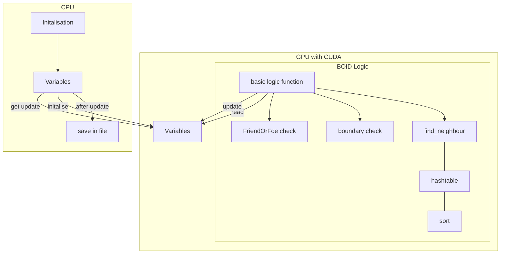

# CuBOIDS

Explorative sandbox for GPU accelerated C and CUDA, with Boids "bird-oid objects" simulation.

## Getting Started

## Roadmap
- Structures for BOID representation:
   - x, y, dx, dy
- CUDA Kernel Functions:
   - Get random initialisation of Positions from the CPU in the beginning. Do not want to programm a pseudo random generator in CUDA... although can probablby easiliy be done with atomic instructions... if supported.
   - GetNeighbours
   - ParallelSort
   - BOID
      - sensory information: near wall or boundary, close BOIDS with there distance/orientation/velocity
         - firendly or predetory behaviour? Avoidance or Follow?
- Datastorage for Output:
   - Plain text for now, or binary, nothing fancy.
- Datadisplay:
   - External Python
 
## Example Flowchart
Can i label this???

## Licence

Distributed under the GNU GENERAL PUBLIC LICENSE. See LICENSE for more information.
