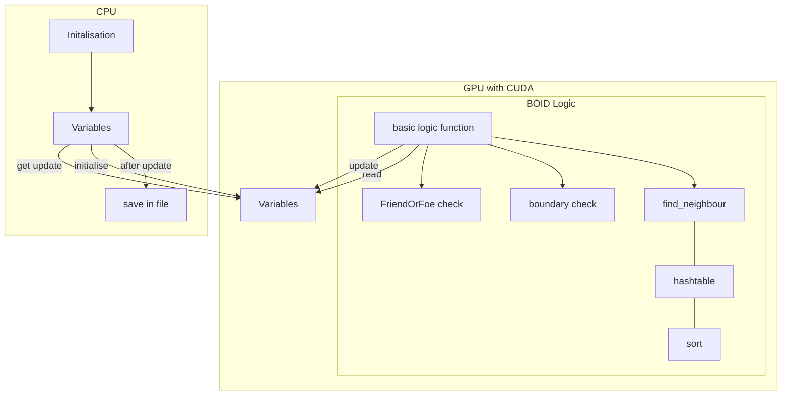
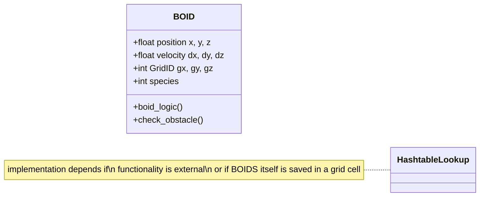

# CuBOIDS

Explorative sandbox for GPU accelerated C and CUDA, with Boids "bird-oid objects" simulation.

## Getting Started

## Roadmap

- Structures for BOID representation:
   - x, y, z, dx, dy, dz
- CUDA Kernel Functions:
   - Get random initialisation of Positions from the CPU in the beginning.
   - GetNeighbours
   - ParallelSort
   - BOID
      - sensory information: near wall or boundary, close BOIDS with their distance/orientation/velocity
      - friendly or predatory behavior? Avoidance or Follow?
- Data storage for Output:
   - Plain text for now, or binary, nothing fancy.
- Data display:
   - External Python
 
## The program flowchart



## Class and function overview

<!-- for documentation of mermaid editor https://mermaid.js.org/syntax/classDiagram.html -->


## Console output

for 100000000 Boids and 10000 bins on the memory shared function:

```console
################################################################################
######################################## INFO ########################################
Number of SMs: 14
Number of  max cores per SM: 1024
Total number of CUDA cores: 896
sharedMemPerMultiprocessor: 65536
sharedMemPerBlock: 49152
l2CacheSize: 1048576
######################################## END  ########################################
number of boids: 100000000 , number of bins: 10000
size of boids: 1144 MB
thread: 896
blocks: 111608
46.4488 ms | 46448.8 µs | 21.5291 it/s
binning on CPU
373.615 ms | 373615 µs | 2.67655 it/s
```

for 100000000 Boids and 10000 bins on the NON-memory shared function:

```console
################################################################################
######################################## INFO ########################################
Number of SMs: 14
Number of  max cores per SM: 1024
Total number of CUDA cores: 896
sharedMemPerMultiprocessor: 65536
sharedMemPerBlock: 49152
l2CacheSize: 1048576
######################################## END  ########################################
number of boids: 100000000 , number of bins: 10000
size of boids: 1144 MB
thread: 896
blocks: 111608
82.8383 ms | 82838.3 µs | 12.0717 it/s
binning on CPU
368.128 ms | 368128 µs | 2.71645 it/s
```

Performance difference in the range of 2. But this a trivial comparison and can not be taken as a final judgement.

## References

__Bibliography__

- <https://doi.org/10.2312/cgvc.20191258>
- [Rama C, Hoetzlein, Graphics Devtech, NVIDIA, FAST FIXED-RADIUS NEAREST NEIGHBORS: INTERACTIVE MILLION-PARTICLE FLUIDS](https://on-demand.gputechconf.com/gtc/2014/presentations/S4117-fast-fixed-radius-nearest-neighbor-gpu.pdf)
- <https://doi.org/10.1111/j.1467-8659.2010.01832.x>

__CUDA - Lecture notes and introduction__

- [Pennsylvania Lecture plan and slides](https://cis565-fall-2021.github.io/syllabus/)
- [Instrucution set for the Lecture course on CUDA flocking](https://github.com/CIS565-Fall-2023/Project1-CUDA-Flocking/blob/main/INSTRUCTION.md)
- [Pennsylvania 2022 Lecture introduction](https://github.com/CIS565-Fall-2022/Project1-CUDA-Flocking/blob/main/INSTRUCTION.md)
- [Pennsylvania Assignment DONE](https://github.com/AmanSachan1/CUDA-Boid-Flocking/tree/master)
- [caltech lecture with notes](http://courses.cms.caltech.edu/cs179/)
- [Pennsylvania hardware setup](https://cis565-fall-2022.github.io/setup/)
- [Hardware setup for Linux](https://cis565-fall-2022.github.io/setup-linux/)
- [NVIDIA: cuCollections header-only library of GPU-accelerated, concurrent data structures](https://github.com/NVIDIA/cuCollections#data-structures)
- [NVIDIA: Maximizing Performance with Massively Parallel Hash Maps on GPUs](https://developer.nvidia.com/blog/maximizing-performance-with-massively-parallel-hash-maps-on-gpus/)

__BOIDS - Introduction and Logic__

- [Paper on BOIDS revisited](https://www.tandfonline.com/doi/full/10.1080/13873950600883485)
- [online introduction to BOIDS](https://betterprogramming.pub/mastering-flock-simulation-with-boids-c-opengl-and-imgui-5a3ddd9cb958)

## Licence

Distributed under the GNU GENERAL PUBLIC LICENSE. See LICENSE for more information.
