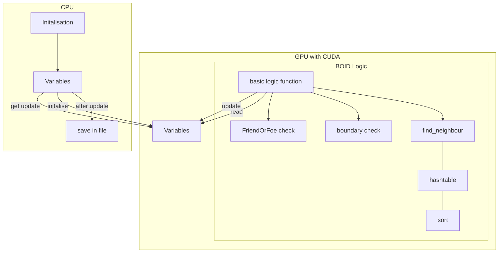
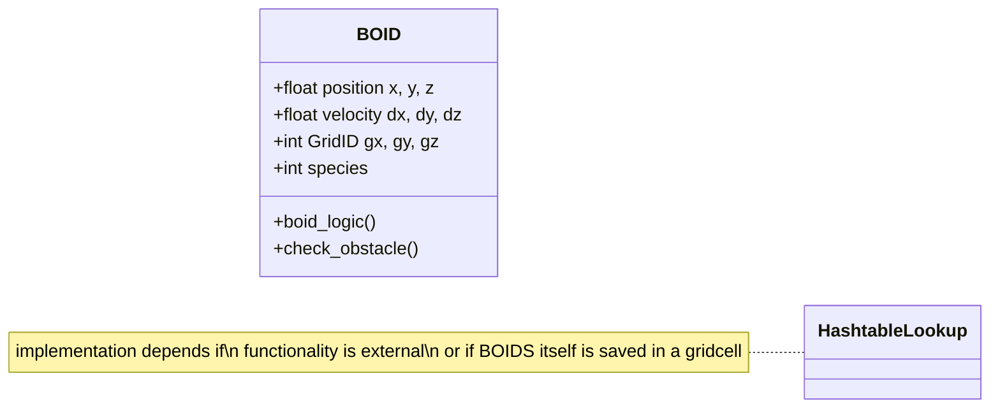

# CuBOIDS

Explorative sandbox for GPU accelerated C and CUDA, with Boids "bird-oid objects" simulation.

## Getting Started

## Roadmap
- Structures for BOID representation:
   - x, y, z, dx, dy, dz
- CUDA Kernel Functions:
   - Get random initialisation of Positions from the CPU in the beginning.
   - GetNeighbours
   - ParallelSort
   - BOID
      - sensory information: near wall or boundary, close BOIDS with there distance/orientation/velocity
      - firendly or predetory behaviour? Avoidance or Follow?
- Datastorage for Output:
   - Plain text for now, or binary, nothing fancy.
- Datadisplay:
   - External Python
 
## The program flowchart

## Class and function overview
<!-- for documentation of mermaid editor https://mermaid.js.org/syntax/classDiagram.html -->

## Aditional Souces

__CUDA - Lecture notes and introduction:__

- [Pennsylvania Lecture plan and slides](https://cis565-fall-2021.github.io/syllabus/)

- [Instrucution set for the Lecute course on CUDA flocking](https://github.com/CIS565-Fall-2023/Project1-CUDA-Flocking/blob/main/INSTRUCTION.md)

- [Pennsylvania 2022 Lecture introduction](https://github.com/CIS565-Fall-2022/Project1-CUDA-Flocking/blob/main/INSTRUCTION.md)

- [Pennsylvania Assignment DONE](https://github.com/AmanSachan1/CUDA-Boid-Flocking/tree/master)

- [caltech lecture with notes](http://courses.cms.caltech.edu/cs179/)

- [Pennsylvania hardware setup](https://cis565-fall-2022.github.io/setup/)

- [Hardware setup for linux](https://cis565-fall-2022.github.io/setup-linux/)

__BOIDS - Introduction and Logic:__

- [Paper on BOIDS revisited](https://www.tandfonline.com/doi/full/10.1080/13873950600883485)

- [online introduction to BOIDS](https://betterprogramming.pub/mastering-flock-simulation-with-boids-c-opengl-and-imgui-5a3ddd9cb958)

## Licence

Distributed under the GNU GENERAL PUBLIC LICENSE. See LICENSE for more information.
